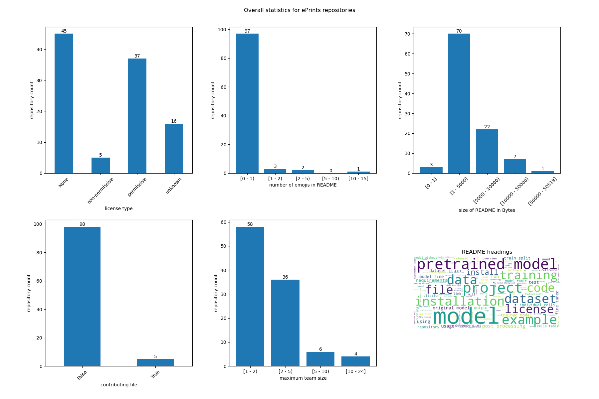

# Notes on RSE repo analysis

## Dataset

### Collection

1. Crawled [23 ePrints repositories](../eprints_repos.txt) for any PDFs dated 2010 until date of analysis (June 2023) ([script](../../eprints/parse_eprints.py)).
2. Parsed every available PDF and searched full text for GitHub links (RegEx pattern `"(?P<url>https?://(www\.)?github\.com[^\s]+)"`) ([script](../../eprints/parse_pdfs.py)). 
3. Matched the detected links to existing GitHub repositories ([script](../../eprints/clean_eprints_links.py)).
4. Used GitHub API to collect a variety of info about each of the repositories ([scripts](../../github/)).

### Structure

[GitHub links in ePrints](./cleaned_links/joined.csv):
- `eprints_repo`: ePrints repository name
- `title`: publication title
- `author_for_reference`: one of the listed authors
- `date`: date given for ePrints publication
- `year`: year extracted from `date`
- `pdf_url`: URL of publication PDF
- `page_no`: number of page where GitHub link was found
- `domain_url`: GitHub link
- `pattern_cleaned_url`: post-processed GitHub link (added RegEx matching)
- `github_user_cleaned_url`: GitHub link matched against an existing repository

[GitHub repository metadata](./metadata.csv):
- `github_user_cleaned_url`: repository ID (format `<user>/<repo_name>`)
- `archived`: whether the repository is archived
- `created_at`: date of repository creation
- `has_wiki`: whether the repository has a wiki
- `has_pages`: whether the repository has GitHub pages

[GitHub repository contents](./contents.csv):
- `github_user_cleaned_url`: repository ID (format `<user>/<repo_name>`)
- `license`: license type as recognised by GitHub API ([more info](https://docs.github.com/en/rest/licenses/licenses?apiVersion=2022-11-28))
- `readme_size`: byte size of README file
- `readme_path`: path to README file (usually `./README.md`)
- `readme_emojis`: number of emojis used in the README file
- `contributing_size`: size of `CONTRIBUTING.md`
- `citation_added`: date that a `CITATION.cff` file was added
- `contributing_added`: date that a `CONTRIBUTING.md` file was added

[GitHub repository contributions](./contributions.csv):
- `github_user_cleaned_url`: repository ID (format `<user>/<repo_name>`)
- `author`: user ID of commit author
- `week_co`: date of start a week
- `commits`: number of commits the author made in that week

[GitHub repository issues](./issues.csv):
- `github_user_cleaned_url`: repository ID (format `<user>/<repo_name>`)
- `state`: issue state at date of crawling (June 2023)
- `created_at`: date of issue creation
- `user`: user ID of issue author
- `closed_at`: date the issue was closed (can be empty)
- `closed_by`: user ID of user who closed the issue (can be empty)

[GitHub repository README evolution](./readme_history.csv):
- `github_user_cleaned_url`: repository ID (format `<user>/<repo_name>`)
- `readme_path`: path to README file (usually `./README.md`)
- `author_date`: date of commit to README
- `added_headings`: new headings
- `deleted_headings`: removed headings
- `added_cites`: new citation info (DOI etc.)

[GitHub repository stars](./stars.csv):
- `github_user_cleaned_url`: repository ID (format `<user>/<repo_name>`)
- `date`: date of star
- `user`: user ID of user that starred the repository

[GitHub repository forks](./forks.csv):
- `github_user_cleaned_url`: repository ID (format `<user>/<repo_name>`)
- `date`: date of fork
- `user`: user ID of user that forked the repository

## Analysis

### ePrints

### GitHub

#### Repository timelines