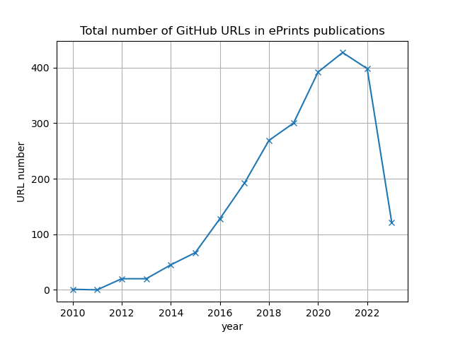
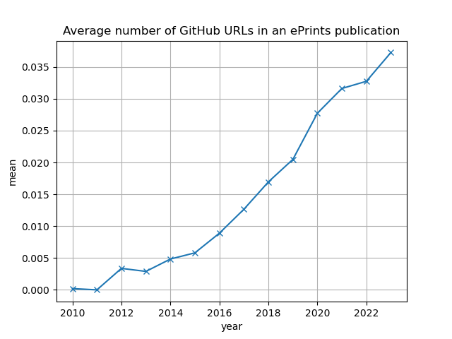
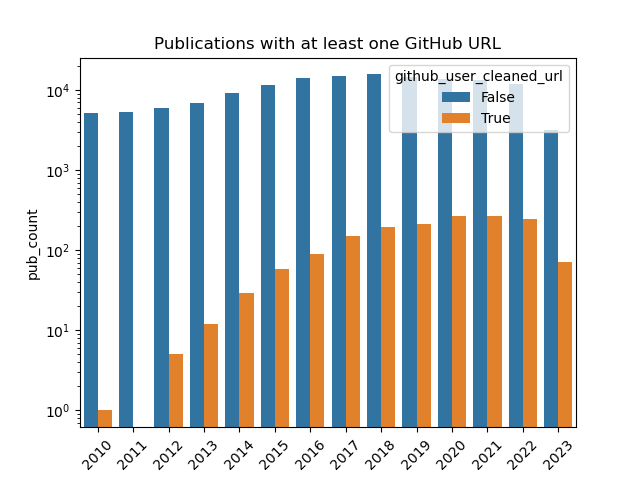
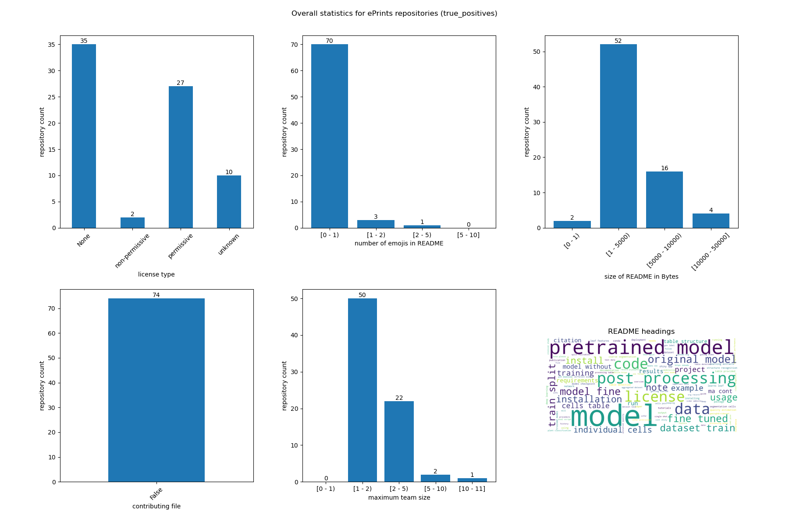
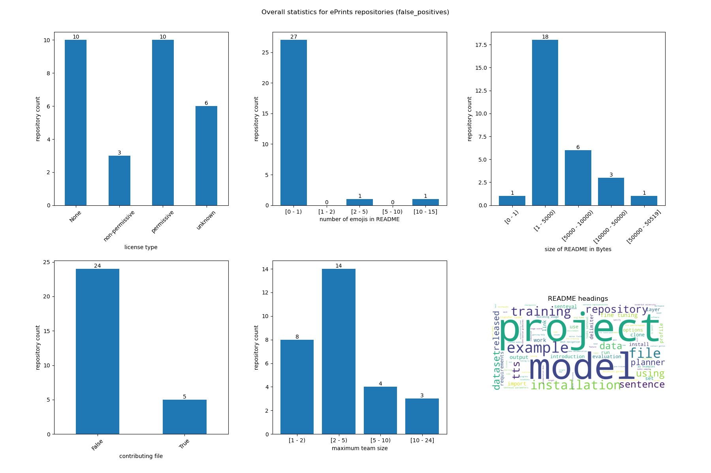
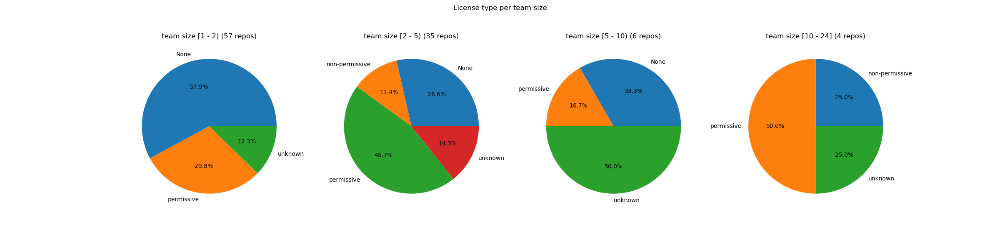
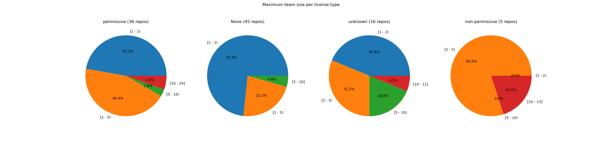
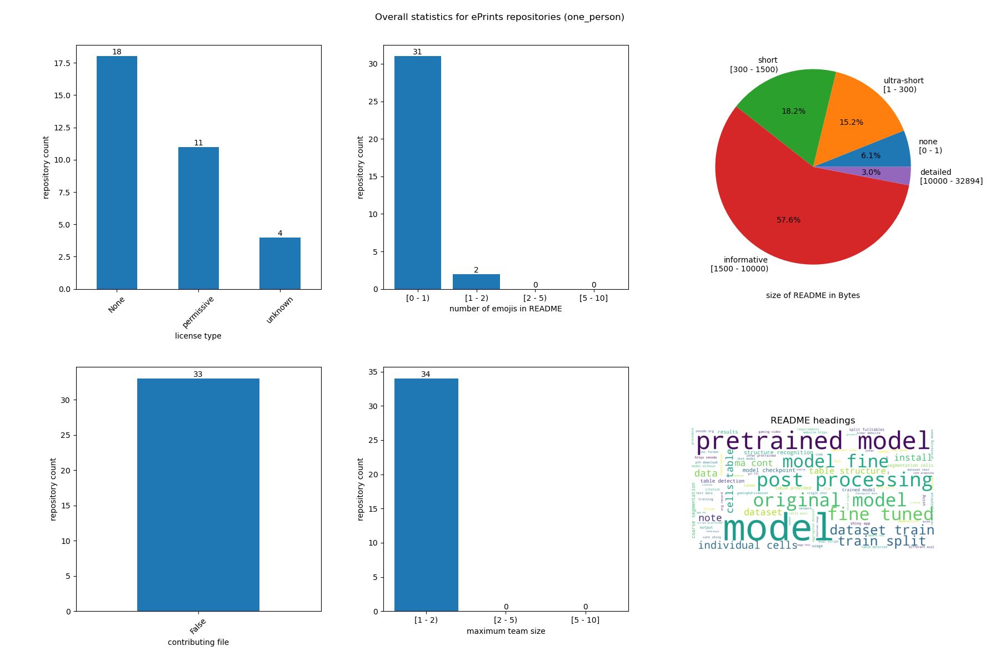
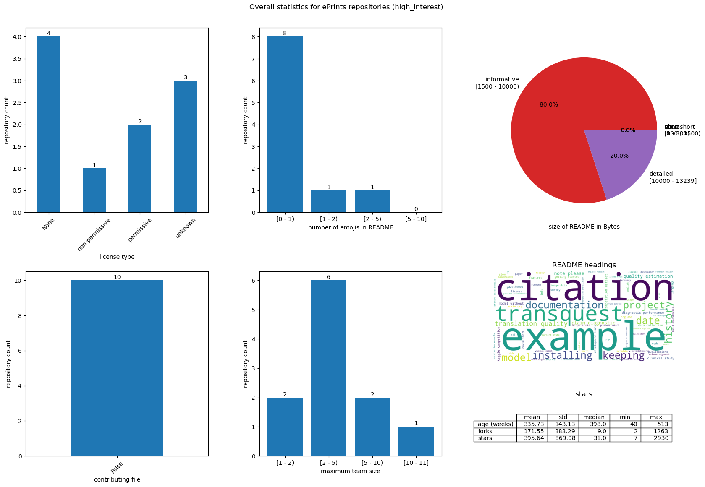
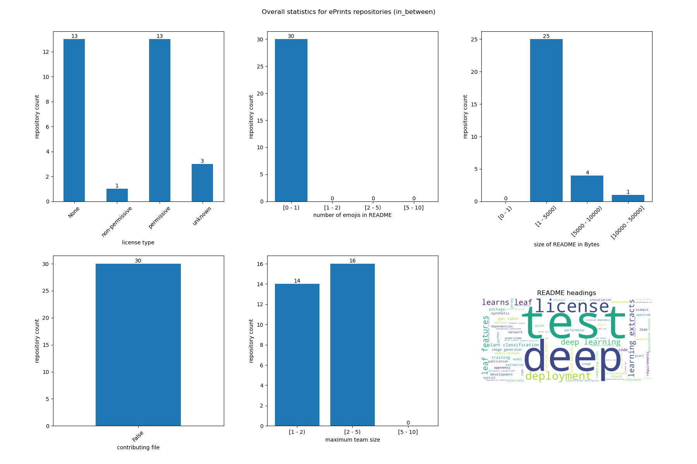

# Notes on RSE repo analysis

**WORK IN PROGRESS.**

## Dataset

### Collection

1. Crawled [23 ePrints repositories](../eprints_repos.txt) for any PDFs dated 2010 until date of analysis (June 2023) ([script](../../eprints/parse_eprints.py)).
2. Parsed every available PDF and searched full text for GitHub links (RegEx pattern `"(?P<url>https?://(www\.)?github\.com[^\s]+)"`) ([script](../../eprints/parse_pdfs.py)). 
3. Matched the detected links to existing GitHub repositories ([script](../../eprints/clean_eprints_links.py)).
4. Used GitHub API to collect a variety of info about each of the repositories ([scripts](../../github/)).

### Structure

[GitHub links in ePrints](./cleaned_links/joined.csv):
- `eprints_repo`: ePrints repository name
- `title`: publication title
- `author_for_reference`: one of the listed authors
- `date`: date given for ePrints publication
- `year`: year extracted from `date`
- `pdf_url`: URL of publication PDF
- `page_no`: number of page where GitHub link was found
- `domain_url`: GitHub link
- `pattern_cleaned_url`: post-processed GitHub link (added RegEx matching)
- `github_user_cleaned_url`: GitHub link matched against an existing repository

[GitHub repository metadata](./metadata.csv):
- `github_user_cleaned_url`: repository ID (format `<user>/<repo_name>`)
- `archived`: whether the repository is archived
- `created_at`: date of repository creation
- `has_wiki`: whether the repository has a wiki
- `has_pages`: whether the repository has GitHub pages

[GitHub repository contents](./contents.csv):
- `github_user_cleaned_url`: repository ID (format `<user>/<repo_name>`)
- `license`: license type as recognised by GitHub API ([more info](https://docs.github.com/en/rest/licenses/licenses?apiVersion=2022-11-28))
- `readme_size`: byte size of README file
- `readme_path`: path to README file (usually `./README.md`)
- `readme_emojis`: number of emojis used in the README file
- `contributing_size`: size of `CONTRIBUTING.md`
- `citation_added`: date that a `CITATION.cff` file was added
- `contributing_added`: date that a `CONTRIBUTING.md` file was added

[GitHub repository contributions](./contributions.csv):
- `github_user_cleaned_url`: repository ID (format `<user>/<repo_name>`)
- `author`: user ID of commit author
- `week_co`: date of start a week
- `commits`: number of commits the author made in that week

[GitHub repository issues](./issues.csv):
- `github_user_cleaned_url`: repository ID (format `<user>/<repo_name>`)
- `state`: issue state at date of crawling (June 2023)
- `created_at`: date of issue creation
- `user`: user ID of issue author
- `closed_at`: date the issue was closed (can be empty)
- `closed_by`: user ID of user who closed the issue (can be empty)

[GitHub repository README evolution](./readme_history.csv) (note that this only parsed headings beginning with "#", not those with "===" underneath):
- `github_user_cleaned_url`: repository ID (format `<user>/<repo_name>`)
- `readme_path`: path to README file (usually `./README.md`)
- `author_date`: date of commit to README
- `added_headings`: new headings
- `deleted_headings`: removed headings
- `added_cites`: new citation info (DOI etc.)

[GitHub repository stars](./stars.csv):
- `github_user_cleaned_url`: repository ID (format `<user>/<repo_name>`)
- `date`: date of star
- `user`: user ID of user that starred the repository

[GitHub repository forks](./forks.csv):
- `github_user_cleaned_url`: repository ID (format `<user>/<repo_name>`)
- `date`: date of fork
- `user`: user ID of user that forked the repository

## Analysis

### ePrints

Code for these plots is in [`analysis/eprints.ipynb`](../../analysis/eprints.ipynb).

Method: Group dataset by year, count number of GitHub links found across all publications of that year.

Method: First, count the number of GitHub links found in each publication separately.
Then, group by year and report the mean.

Method: Group dataset by year and count how many publications contained at least one GitHub link.
Those that did are displayed in orange bars, those that did not contain a single link are shown in blue bars.
Note that the y-axis scales logarithmically.
On top of the bars is the percentage of the total number of publications represented by the bar.

### GitHub

#### License types and team sizes

1-person teams tend to have no license. Permissive licenses are more common than non-permissive throughout.

#### Repository timelines

Timelines were plotted for each repository mentioned on the first two pages of the publication that was manually verified as the code for this publication ("true positives"). The upper plot shows how users interact with repository issues. We take a rolling window approach, where a user is considered to be opening issues up until 12 weeks after opening an issue, similarly for closing issues. The middle plot shows the same analysis for contributions (i.e. commits). The last plot shows summary statistics over time, such as forks, stars and contributor team size. Highlights are depicted with little triangles.

We can roughly separate the repositories into three groups: 
- one-person repositories, where only one user makes contributions and interacts with issues (34 repositories)
- high-interest repositories, where many (>5 I think, this was decided visually) users contribute and interact with issues (11 repositories)
- everything in between (30 repositories).

Of course, this separation disregards that some repositories are developed by teams rather than just one person and that this might be the reason for the "high interest", but it's just a starting point, not a result.

##### One-person repositories

READMEs tend to be informative, but largest proportion of less informative READMEs in this category.

This one is interesting: It seems to have a README with essential information, but very low interest. It might be a data repository rather than code? It doesn't seem to make use of issues much though, even though commits are happening.

What happens in the second contribution spike?

Two forks, active contribution by the owner throughout, but no issues, so no pull requests. What happens in those forks? Would a CONTRIBUTING file help?

Active contribution for a longer period than expected, what sort of changes are implemented?

"Lots" of stars, but nothing else. Could an informative README or CONTRIBUTING have helped?

README is in fact pretty empty, but paper was presented at NeurIPS workshop, which is probably why it has so many stars.

Now, these are lots of stars! And a number of forks, too. But no README or CONTRIBUTING. Can we find repos with similar amounts of stars that manage to get contributors? Why were no issues opened?

Really nothing, and the README is more or less empty. It points to a website though, which also links the paper. Can't check the forks because they are too old.

Multiple forks, why?

Forks are inactive. 

What's the difference between this and repos with no stars?

It has an informative README and a licence. The forks are inactive though.

##### High-interest repositories

These don't seem to have a CONTRIBUTING file. Are the new contributors team members that take over the project? Are they new people with pull requests?

Best READMEs across the board.

Looks to me like jvdb is a new contributor.

Owner seems very active, maybe that's why all the people interacting with issues aren't contributing?

Lots of opening and closing issues when no contributions happen?

##### In between

Why is the owner closing issues, but not contributing?

Looks like a team effort that picked up late.

Lots of forks, no new contributors.

The README is quite long, and it's also an ML project. I get the feeling that ML project get higher engagement by default? 2 of the forks were updated at some point.

##### Thoughts

There are a few repos with high number of stars and decent number of forks that do not have any new contributors. None of the repos seem to use issues a lot, mostly for bug fixing (i.e. open shortly)? Maybe people are more inclined to contribute with a CONTRIBUTING file and some inviting tags like "good first issue" etc.

ML repos might lead to higher engagement per default, I think (haven't validated) that the one-person repos with some engagement usually had to do with ML.

##### Patterns

The main pattern seems to be 
1. Publication
2. Interest
3. Dormant

with some variations in terms of magnitude.
For example, in one-person repos the interest only shows as stars. They go dormant quicker than the others.
High-interest repositories keep interest for longer, and it takes a different form, i.e. forks, PRs contributions (see for example `GazeTheWeb`). 
Still, they go quiet after a while, meaning that the number of active contributors goes down and there is less fluctuation in the number of issues. 
An exception is the repository `nilmtk` which experiences interest in phases, i.e. not growth in interest, but decreasing interest followed by again increased interest with newer contributors.

In `esbmc`, we can observe two phases of interest after publication: One where the contributor pool grows slowly and then one where it grows much quicker.

Mentions in publications later on (probably as related work or tool instead of "original work") often lead to a spike in stars, sometimes even in forks.

The number of forks grows with the number of stars at a lower rate.
One exception is `dissect-cf`, where the number of forks is larger than that of stars.

There are also a handful of repositories with apparently highly responsive owners (e.g. `Dusty-evolved-starkit` and `transquest`).
Many issues are opened, but all are resolved by the owner so the contributing team does not grow.
See caveats about this though.

People who open issues and fork at the same time are usually adding a PR. These people can become contributors, i.e. make commits to the main branch.
They don't do that when they are not interacted with though, meaning that their issues are left open.
One example of this is `MOEADr`, where issues aren't responded to and PRs aren't commented on.

##### Caveats

- Issues can be normal issues or PRs.
- PRs are not shown as commits: when someone makes a PR with multiple commits, merging this PR does not count as a commit itself, so it doesn't show up for the person merging it (that's the person closing the issue) and the commits that belonged to the PR do not show up either. Commits are only commits (that are not merge commits) to the main branch. This means that a good development workflow of PR, commit, merge yields NO trace in the contributor graph. (Example: `incone`, has a closed PR by another user, but the graph does not show that user as a contributor.)
- The publication mention date might not be ideal - it's extracted from ePrints (`date` field), but maybe we should extract it from another source. Then again, the publication date is a bit arbitrary in any case due to the delay between preprints, conferences and journal publication....

##### Things to (possibly) investigate

- Pick out some repos (e.g. the ones mentioned as examples and a couple more) and draw the phases on them. Look at the length and start of those phases in terms of weeks: When do new contributors arrive? When does the repository go dormant?
- Differentiate between inactive forks, active forks that opened a PR and active forks that didn't open a PR.
- Does it help if the repository used issues from the beginning? I feel like most of the repos didn't do that, issues are start being opened once other people start engaging with the project.
- Does it help to respond to people's issues and close them?
- Are new people more likely to open issues if at publication date some issues had already been opened?